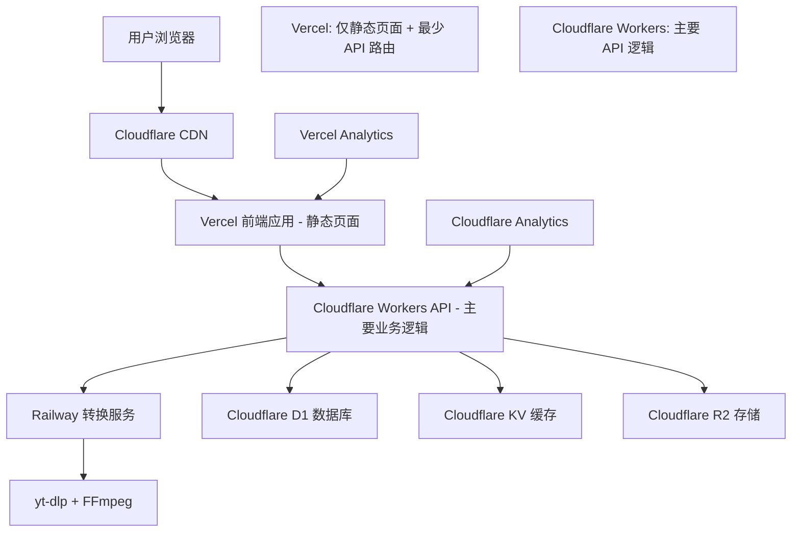

# 设计文档

## 概述

GetGoodTape 是一个现代化的视频转换平台，专注于将各大社交媒体平台的视频转换为 MP3 和 MP4 格式。系统采用微服务架构，前端使用现代 Web 技术，后端使用 Node.js/Python，并集成专业的视频处理工具。

## 架构

### 系统架构图



### Cloudflare + Vercel 生态系统优势

**成本效益：**

- Cloudflare Workers: 免费额度 100,000 请求/天
- Cloudflare R2: 免费额度 10GB 存储
- Cloudflare D1: 免费额度 100,000 读取/天
- Vercel Hobby: 免费额度，但有 Serverless Functions 限制

**Vercel Hobby 限制考虑：**

- 最多 12 个 Serverless Functions
- 10 秒执行时间限制
- 1024MB 内存限制
- 因此将主要 API 逻辑放在 Cloudflare Workers

**性能优势：**

- 全球边缘网络，低延迟
- 自动缓存和 CDN 加速
- 无服务器架构，按需扩展

**开发体验：**

- 简单的部署流程
- 内置监控和分析
- 无需管理服务器基础设施

### Vercel Hobby 限制优化策略

**最小化 Vercel Functions 使用：**

- Vercel 主要用于静态页面托管和 SSG
- 仅保留必要的 API 路由（如健康检查、重定向）
- 主要 API 逻辑迁移到 Cloudflare Workers

**推荐的 Vercel Functions 分配：**

1. `/api/health` - 健康检查
2. `/api/sitemap` - 动态站点地图生成
3. `/api/robots` - robots.txt 生成
4. 预留 9 个 functions 用于未来 SEO 相关功能

**主要业务逻辑在 Cloudflare Workers：**

- `/api/convert` - 转换请求处理
- `/api/status` - 状态查询
- `/api/platforms` - 平台信息
- `/api/download` - 文件下载代理

### 技术栈选择

**前端：**

- React 18 + Next.js 14 (SSR/SSG 支持 SEO)
- TypeScript (类型安全)
- Tailwind CSS (快速样式开发)
- React Query (状态管理和缓存)

**后端：**

- Cloudflare Workers (API 服务，TypeScript)
- Railway/Render (视频处理服务，Python + FastAPI)
- yt-dlp (多平台视频下载)
- FFmpeg (音视频转换)

**数据库：**

- Cloudflare D1 (SQLite 数据库)
- Cloudflare KV (键值存储，替代 Redis)

**存储：**

- Cloudflare R2 (文件存储，兼容 S3 API)
- Cloudflare CDN (全球加速)

**部署：**

- Vercel (前端部署)
- Cloudflare Workers (后端 API)
- Railway / Render (视频处理服务)

## 组件和接口

### 前端组件

#### 1. 主转换界面 (ConversionPage)

```typescript
interface ConversionPageProps {
  supportedPlatforms: Platform[];
  defaultFormat: 'mp3' | 'mp4';
}

interface ConversionState {
  url: string;
  format: 'mp3' | 'mp4';
  quality: string;
  status: 'idle' | 'processing' | 'completed' | 'error';
  progress: number;
  result?: ConversionResult;
}
```

#### 2. URL 输入组件 (URLInput)

```typescript
interface URLInputProps {
  onUrlChange: (url: string) => void;
  onSubmit: () => void;
  isValid: boolean;
  supportedPlatforms: Platform[];
}
```

#### 3. 格式选择器 (FormatSelector)

```typescript
interface FormatSelectorProps {
  selectedFormat: 'mp3' | 'mp4';
  onFormatChange: (format: 'mp3' | 'mp4') => void;
  qualityOptions: QualityOption[];
  selectedQuality: string;
  onQualityChange: (quality: string) => void;
}
```

#### 4. 进度显示器 (ProgressIndicator)

```typescript
interface ProgressIndicatorProps {
  status: ConversionStatus;
  progress: number;
  estimatedTime?: number;
  currentStep: string;
}
```

### 后端 API 接口

#### Vercel API Routes (最小化使用)

```typescript
// /api/health - Vercel Function
export async function GET() {
  return Response.json({ status: 'ok', timestamp: Date.now() });
}

// /api/sitemap - Vercel Function (SEO)
export async function GET() {
  // 动态生成站点地图
  return new Response(sitemapXml, {
    headers: { 'Content-Type': 'application/xml' },
  });
}
```

#### Cloudflare Workers API (主要业务逻辑)

```typescript
// POST https://api.getgoodtape.com/convert
interface ConvertRequest {
  url: string;
  format: 'mp3' | 'mp4';
  quality: string;
  platform?: string; // 自动检测或手动指定
}

interface ConvertResponse {
  jobId: string;
  status: 'queued' | 'processing' | 'completed' | 'failed';
  progress: number;
  downloadUrl?: string;
  metadata?: VideoMetadata;
  error?: string;
}

// GET https://api.getgoodtape.com/status/{jobId}
interface StatusResponse {
  jobId: string;
  status: ConversionStatus;
  progress: number;
  downloadUrl?: string;
  metadata?: VideoMetadata;
  error?: string;
}

// GET https://api.getgoodtape.com/platforms
interface PlatformsResponse {
  platforms: Platform[];
}

interface Platform {
  name: string;
  domain: string;
  supportedFormats: string[];
  maxDuration: number;
  icon: string;
}
```

### 核心服务接口

#### 1. 平台解析服务 (PlatformResolver)

```python
class PlatformResolver:
    def detect_platform(self, url: str) -> Platform
    def extract_metadata(self, url: str) -> VideoMetadata
    def validate_url(self, url: str) -> bool
    def get_download_info(self, url: str) -> DownloadInfo
```

#### 2. 转换服务 (ConversionService)

```python
class ConversionService:
    def convert_to_mp3(self, input_path: str, quality: str) -> str
    def convert_to_mp4(self, input_path: str, quality: str) -> str
    def get_conversion_progress(self, job_id: str) -> float
    def cancel_conversion(self, job_id: str) -> bool
```

#### 3. 文件管理服务 (FileManager)

```python
class FileManager:
    def upload_temp_file(self, file_path: str) -> str
    def generate_download_url(self, file_id: str) -> str
    def cleanup_expired_files(self) -> None
    def get_file_info(self, file_id: str) -> FileInfo
```

## 数据模型

### 数据库表结构

#### 1. 转换任务表 (conversion_jobs) - Cloudflare D1

```sql
CREATE TABLE conversion_jobs (
    id TEXT PRIMARY KEY,
    url TEXT NOT NULL,
    platform TEXT NOT NULL,
    format TEXT NOT NULL,
    quality TEXT NOT NULL,
    status TEXT NOT NULL DEFAULT 'queued',
    progress INTEGER DEFAULT 0,
    file_path TEXT,
    download_url TEXT,
    metadata TEXT, -- JSON 字符串
    error_message TEXT,
    created_at INTEGER DEFAULT (strftime('%s', 'now')),
    updated_at INTEGER DEFAULT (strftime('%s', 'now')),
    expires_at INTEGER DEFAULT (strftime('%s', 'now', '+24 hours'))
);
```

#### 2. 平台配置表 (platforms) - Cloudflare D1

```sql
CREATE TABLE platforms (
    id INTEGER PRIMARY KEY AUTOINCREMENT,
    name TEXT NOT NULL,
    domain TEXT NOT NULL,
    supported_formats TEXT NOT NULL, -- JSON 数组字符串
    max_duration INTEGER DEFAULT 7200,
    is_active INTEGER DEFAULT 1, -- SQLite 使用 INTEGER 作为 BOOLEAN
    config TEXT -- JSON 字符串
);
```

#### 3. 使用统计表 (usage_stats) - Cloudflare D1

```sql
CREATE TABLE usage_stats (
    id INTEGER PRIMARY KEY AUTOINCREMENT,
    date TEXT NOT NULL, -- ISO 日期字符串
    platform TEXT NOT NULL,
    format TEXT NOT NULL,
    total_conversions INTEGER DEFAULT 0,
    successful_conversions INTEGER DEFAULT 0,
    total_duration INTEGER DEFAULT 0
);
```

### 数据传输对象

#### VideoMetadata

```typescript
interface VideoMetadata {
  title: string;
  duration: number;
  thumbnail: string;
  uploader: string;
  uploadDate: string;
  viewCount?: number;
  description?: string;
  tags?: string[];
}
```

#### ConversionResult

```typescript
interface ConversionResult {
  downloadUrl: string;
  filename: string;
  fileSize: number;
  format: string;
  quality: string;
  duration: number;
  expiresAt: string;
}
```

## 错误处理

### 错误类型定义

```typescript
enum ErrorType {
  INVALID_URL = 'INVALID_URL',
  UNSUPPORTED_PLATFORM = 'UNSUPPORTED_PLATFORM',
  VIDEO_NOT_FOUND = 'VIDEO_NOT_FOUND',
  VIDEO_TOO_LONG = 'VIDEO_TOO_LONG',
  CONVERSION_FAILED = 'CONVERSION_FAILED',
  DOWNLOAD_FAILED = 'DOWNLOAD_FAILED',
  SERVER_ERROR = 'SERVER_ERROR',
  RATE_LIMIT_EXCEEDED = 'RATE_LIMIT_EXCEEDED',
}

interface ApiError {
  type: ErrorType;
  message: string;
  details?: any;
  retryable: boolean;
}
```

### 错误处理策略

1. **客户端错误处理**
   - 输入验证和实时反馈
   - 用户友好的错误消息
   - 自动重试机制（适用于网络错误）

2. **服务端错误处理**
   - 结构化错误日志
   - 错误监控和告警
   - 优雅降级和熔断机制

3. **转换错误处理**
   - 多重下载源尝试
   - 格式回退机制
   - 部分失败的处理

## 测试策略

### 单元测试

- 前端组件测试 (Jest + React Testing Library)
- 后端 API 测试 (Jest/Pytest)
- 工具函数测试

### 集成测试

- API 端到端测试
- 数据库集成测试
- 第三方服务集成测试

### 性能测试

- 并发转换测试
- 大文件处理测试
- 负载测试

### 用户验收测试

- 主要用户流程测试
- 跨浏览器兼容性测试
- 移动端响应式测试

## 性能优化

### 前端优化

- 代码分割和懒加载
- 图片优化和 WebP 支持
- Service Worker 缓存
- CDN 加速

### 后端优化

- Redis 缓存热点数据
- 数据库查询优化
- 连接池管理
- 异步任务队列

### 转换优化

- 并行处理管道
- 智能质量选择
- 预处理缓存
- 增量转换

## 部署策略

### 前端部署 (Vercel) - 优化配置

```json
// vercel.json
{
  "framework": "nextjs",
  "buildCommand": "npm run build",
  "outputDirectory": ".next",
  "functions": {
    "app/api/health/route.ts": {
      "maxDuration": 5
    },
    "app/api/sitemap/route.ts": {
      "maxDuration": 10
    }
  },
  "env": {
    "NEXT_PUBLIC_API_URL": "https://api.getgoodtape.com"
  },
  "rewrites": [
    {
      "source": "/api/convert/:path*",
      "destination": "https://api.getgoodtape.com/convert/:path*"
    },
    {
      "source": "/api/status/:path*",
      "destination": "https://api.getgoodtape.com/status/:path*"
    }
  ]
}
```

**Next.js 配置优化：**

```javascript
// next.config.js
/** @type {import('next').NextConfig} */
const nextConfig = {
  output: 'standalone', // 减少 bundle 大小
  experimental: {
    appDir: true,
  },
  // 大部分页面使用静态生成
  generateStaticParams: true,
};

module.exports = nextConfig;
```

### API 部署 (Cloudflare Workers)

```typescript
// wrangler.toml
name = 'getgoodtape-api';
main = 'src/index.ts';
compatibility_date = '2024-01-01'[env.production];
vars = { ENVIRONMENT = 'production' }[[env.production.d1_databases]];
binding = 'DB';
database_name = 'getgoodtape-prod';
database_id = 'your-database-id'[[env.production.r2_buckets]];
binding = 'STORAGE';
bucket_name = 'getgoodtape-files';
```

### 视频处理服务部署 (Railway)

```dockerfile
# Dockerfile
FROM python:3.11-slim

RUN apt-get update && apt-get install -y \
    ffmpeg \
    && rm -rf /var/lib/apt/lists/*

COPY requirements.txt .
RUN pip install -r requirements.txt

COPY . .
CMD ["uvicorn", "main:app", "--host", "0.0.0.0", "--port", "$PORT"]
```

### 环境配置

```bash
# 生产环境变量
CLOUDFLARE_API_TOKEN=your-token
DATABASE_URL=your-d1-database-url
R2_BUCKET_NAME=getgoodtape-files
PROCESSING_SERVICE_URL=https://your-railway-app.railway.app
```

## 安全考虑

### 输入验证

- URL 格式验证
- 平台白名单检查
- 文件类型验证
- 大小限制检查

### 访问控制

- 速率限制 (Rate Limiting)
- IP 黑名单
- CORS 配置
- CSRF 保护

### 数据保护

- 临时文件加密
- 安全文件删除
- 访问日志记录
- 隐私数据处理

### 基础设施安全

- HTTPS 强制
- 安全头设置
- 容器安全扫描
- 依赖漏洞检查
