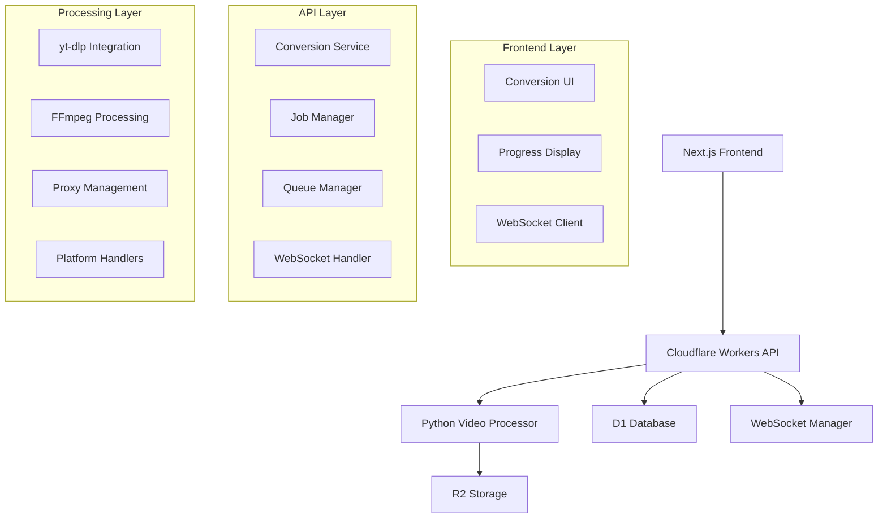

# Design Document

## Overview

This design addresses the critical issue where GetGoodTape's conversion functionality is stuck at 0% progress across all platforms. The system consists of three main layers: a Next.js frontend, Cloudflare Workers API, and a Python FastAPI video processing service. The core problem appears to be in the communication and progress tracking between these layers, particularly affecting the conversion pipeline's ability to report real-time progress and complete successfully.

## Architecture

### Current System Architecture



### Problem Areas Identified

1. **Progress Reporting**: Jobs get stuck at 0% due to broken progress update chain
2. **WebSocket Communication**: Real-time updates not reaching frontend
3. **Job State Management**: Race conditions in job status updates
4. **Platform-Specific Issues**: YouTube anti-bot detection causing failures
5. **Error Recovery**: Insufficient fallback mechanisms

## Components and Interfaces

### 1. Conversion Service (Workers API)

**Primary Interface**: `ConversionService`
- **Purpose**: Orchestrate conversion jobs and manage progress tracking
- **Key Methods**:
  - `startConversion(request)`: Initialize conversion job
  - `processConversion(jobId, request)`: Execute conversion pipeline
  - `getConversionStatus(jobId)`: Retrieve job status and progress
  - `updateProgressWithNotification(jobId, progress)`: Update progress with WebSocket notification

**Critical Fix Areas**:
- Ensure progress updates are atomic and properly propagated
- Implement proper job locking to prevent race conditions
- Add comprehensive error classification and recovery

### 2. Job Manager

**Primary Interface**: `JobManager`
- **Purpose**: Manage job lifecycle and database operations
- **Key Methods**:
  - `createJob(url, platform, format, quality)`: Create new job record
  - `startProcessing(jobId)`: Lock job for processing
  - `updateProgress(jobId, progress)`: Update job progress
  - `completeJob(jobId, downloadUrl, filename)`: Mark job as completed

**Critical Fix Areas**:
- Fix progress update queries to ensure they persist correctly
- Implement proper job state transitions
- Add job timeout and cleanup mechanisms

### 3. WebSocket Manager

**Primary Interface**: `WebSocketManager`
- **Purpose**: Provide real-time progress updates to frontend
- **Key Methods**:
  - `sendProgressUpdate(jobId, progress, status)`: Send progress to connected clients
  - `sendCompletion(jobId, downloadUrl, filename)`: Notify completion
  - `handleConnection(websocket)`: Manage client connections

**Critical Fix Areas**:
- Ensure WebSocket connections are properly maintained
- Implement connection recovery and retry logic
- Add proper error handling for failed message delivery

### 4. Video Processing Service

**Primary Interface**: FastAPI endpoints
- **Purpose**: Handle actual video download and conversion
- **Key Endpoints**:
  - `POST /convert`: Main conversion endpoint
  - `POST /extract-metadata`: Extract video metadata
  - `GET /health`: Service health check

**Critical Fix Areas**:
- Implement proper progress reporting back to Workers API
- Add platform-specific handling for YouTube restrictions
- Improve proxy management and fallback strategies

### 5. Platform Handlers

**Purpose**: Handle platform-specific extraction and conversion logic

#### YouTube Handler
- **Challenge**: Anti-bot detection and access restrictions
- **Solution**: Multiple extraction methods with fallback strategies
- **Implementation**: 
  - iOS/Android client emulation
  - Proxy rotation
  - Clear error messaging for restricted content

#### Twitter/X Handler
- **Priority**: Ensure stable operation
- **Implementation**: Direct API access with minimal proxy usage

#### Other Platforms (TikTok, Instagram)
- **Priority**: Maintain current stability
- **Implementation**: Platform-specific optimizations

## Data Models

### Job Record
```typescript
interface Job {
  id: string;
  url: string;
  platform: string;
  format: string;
  quality: string;
  status: 'queued' | 'processing' | 'completed' | 'failed';
  progress: number; // 0-100
  download_url?: string;
  file_path?: string;
  r2_key?: string;
  download_expires_at?: number;
  error_message?: string;
  metadata?: string; // JSON
  created_at: number;
  updated_at: number;
  expires_at: number;
}
```

### Progress Update
```typescript
interface ProgressUpdate {
  jobId: string;
  progress: number;
  status: string;
  currentStep?: string;
  additionalData?: Record<string, unknown>;
}
```

### Error Classification
```typescript
interface ErrorClassification {
  type: ErrorType;
  severity: 'low' | 'medium' | 'high' | 'critical';
  retryable: boolean;
  maxRetries: number;
  userMessage: string;
  suggestion?: string;
}
```

## Error Handling

### Error Classification System

1. **YouTube Access Denied**
   - **Type**: ACCESS_DENIED
   - **Retryable**: Yes (3 attempts)
   - **Fallback**: Use proxy, try alternative methods
   - **User Message**: Clear explanation of YouTube restrictions

2. **Network Errors**
   - **Type**: NETWORK_ERROR
   - **Retryable**: Yes (3 attempts with exponential backoff)
   - **Fallback**: Retry with different proxy or direct connection

3. **Conversion Timeout**
   - **Type**: CONVERSION_FAILED
   - **Retryable**: Yes (2 attempts)
   - **Fallback**: Reduce quality, optimize processing

4. **Storage Errors**
   - **Type**: SERVER_ERROR
   - **Retryable**: No
   - **Action**: Cleanup files, alert administrators

### Recovery Strategies

1. **Progress Recovery**: If job appears stuck, check last update time and resume processing
2. **WebSocket Recovery**: Implement connection retry with exponential backoff
3. **Platform Fallback**: For YouTube failures, clearly indicate platform-specific issues
4. **Quality Fallback**: Automatically reduce quality for timeout issues

## Testing Strategy

### Unit Tests

1. **ConversionService Tests**
   - Progress update propagation
   - Job state transitions
   - Error handling and recovery
   - Cache functionality

2. **JobManager Tests**
   - Database operations
   - Job locking mechanisms
   - Progress persistence
   - Cleanup operations

3. **WebSocket Tests**
   - Connection management
   - Message delivery
   - Error handling
   - Reconnection logic

### Integration Tests

1. **End-to-End Conversion Flow**
   - Complete conversion pipeline
   - Progress tracking accuracy
   - File storage and retrieval
   - Error scenarios

2. **Platform-Specific Tests**
   - Twitter/X conversion stability
   - YouTube error handling
   - Other platform compatibility

3. **Performance Tests**
   - Concurrent conversion handling
   - Progress update frequency
   - WebSocket scalability

### Diagnostic Tools

1. **Health Check Endpoints**
   - Service availability
   - Dependency status
   - Performance metrics

2. **Debug Interfaces**
   - Job status inspection
   - Progress tracking visualization
   - Error log aggregation

3. **Monitoring Dashboards**
   - Conversion success rates
   - Platform-specific metrics
   - Error frequency analysis

## Implementation Priorities

### Phase 1: Critical Fixes (Immediate)
1. Fix progress update mechanism in ConversionService
2. Ensure WebSocket notifications are properly sent
3. Implement proper job state management
4. Add comprehensive error logging

### Phase 2: Platform Stability (Short-term)
1. Optimize Twitter/X conversion reliability
2. Implement YouTube error messaging
3. Ensure other platforms maintain stability
4. Add platform-specific fallback strategies

### Phase 3: Enhanced Recovery (Medium-term)
1. Implement advanced error recovery
2. Add conversion result caching
3. Optimize performance and scalability
4. Enhance monitoring and diagnostics

## Security Considerations

1. **API Security**: Ensure proper authentication between services
2. **Storage Security**: Secure R2 storage access and presigned URLs
3. **Proxy Security**: Secure proxy credentials and rotation
4. **Error Information**: Avoid exposing sensitive information in error messages

## Performance Optimizations

1. **Caching Strategy**: Cache successful conversions to avoid reprocessing
2. **Queue Management**: Implement efficient job queuing and processing
3. **Resource Management**: Optimize memory and CPU usage in processing service
4. **Connection Pooling**: Efficient database and storage connections