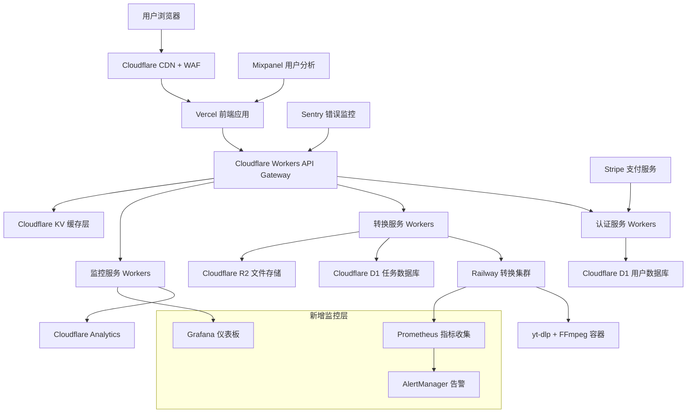

# 生产优化设计文档

## 概述

本设计文档基于 GetGoodTape 现有的技术架构，提出生产环境优化的具体技术方案。重点关注系统稳定性、用户体验、性能扩展和商业化运营能力的提升，确保项目能够支撑大规模用户访问和长期商业运营。

## 架构

### 优化后的系统架构



### 核心优化策略

1. **微服务拆分**：将单一 Workers 拆分为专门的认证、转换、监控服务
2. **多层缓存**：KV 缓存 + CDN 缓存 + 浏览器缓存
3. **智能负载均衡**：基于地理位置和负载的动态路由
4. **容错设计**：熔断器、重试机制、优雅降级
5. **实时监控**：全链路追踪、性能监控、业务指标

## 组件和接口

### 1. 错误处理和监控系统

#### 统一错误处理中间件

```typescript
// workers/src/middleware/error-handler.ts
export class ErrorHandler {
  static async handle(error: Error, request: Request): Promise<Response> {
    const errorId = generateErrorId();
    const errorInfo = {
      id: errorId,
      message: error.message,
      stack: error.stack,
      url: request.url,
      method: request.method,
      timestamp: new Date().toISOString(),
      userAgent: request.headers.get('user-agent'),
    };

    // 发送到 Sentry
    await this.sendToSentry(errorInfo);

    // 记录到 D1 数据库
    await this.logToDatabase(errorInfo);

    // 返回用户友好的错误响应
    return this.createUserFriendlyResponse(error, errorId);
  }

  private static createUserFriendlyResponse(
    error: Error,
    errorId: string
  ): Response {
    const errorMap = {
      YOUTUBE_BLOCKED: {
        message: '视频暂时无法访问，请稍后重试或尝试其他视频',
        suggestion: '我们正在优化访问策略，通常几分钟后即可恢复',
        retryable: true,
      },
      VIDEO_TOO_LONG: {
        message: '视频时长超过限制（最长2小时）',
        suggestion: '请选择较短的视频，或联系客服了解高级套餐',
        retryable: false,
      },
      CONVERSION_FAILED: {
        message: '转换过程中出现问题',
        suggestion: '请检查视频链接是否有效，或尝试不同的质量设置',
        retryable: true,
      },
    };

    const errorType = this.classifyError(error);
    const errorResponse = errorMap[errorType] || {
      message: '服务暂时不可用',
      suggestion: '请稍后重试，如问题持续请联系客服',
      retryable: true,
    };

    return Response.json(
      {
        success: false,
        error: {
          id: errorId,
          type: errorType,
          message: errorResponse.message,
          suggestion: errorResponse.suggestion,
          retryable: errorResponse.retryable,
          timestamp: new Date().toISOString(),
        },
      },
      { status: 500 }
    );
  }
}
```

#### 实时监控仪表板

```typescript
// workers/src/services/monitoring-service.ts
export class MonitoringService {
  async collectMetrics(): Promise<SystemMetrics> {
    return {
      // 系统指标
      system: {
        cpuUsage: await this.getCPUUsage(),
        memoryUsage: await this.getMemoryUsage(),
        diskUsage: await this.getDiskUsage(),
        networkLatency: await this.getNetworkLatency(),
      },

      // 业务指标
      business: {
        activeUsers: await this.getActiveUsers(),
        conversionRate: await this.getConversionRate(),
        averageProcessingTime: await this.getAverageProcessingTime(),
        errorRate: await this.getErrorRate(),
      },

      // 成本指标
      cost: {
        cloudflareRequests: await this.getCloudflareUsage(),
        railwayComputeTime: await this.getRailwayUsage(),
        storageUsage: await this.getStorageUsage(),
        proxyUsage: await this.getProxyUsage(),
      },
    };
  }

  async createAlert(condition: AlertCondition): Promise<void> {
    const alert = {
      id: generateAlertId(),
      condition,
      timestamp: new Date().toISOString(),
      severity: this.calculateSeverity(condition),
      message: this.generateAlertMessage(condition),
    };

    // 发送到多个通知渠道
    await Promise.all([
      this.sendToSlack(alert),
      this.sendToEmail(alert),
      this.sendToSMS(alert), // 仅高严重性告警
    ]);
  }
}
```

### 2. 用户体验优化

#### 智能进度预测

```typescript
// components/EnhancedProgressIndicator.tsx
interface ProgressPrediction {
  estimatedTimeRemaining: number;
  confidence: number;
  factors: {
    videoLength: number;
    fileSize: number;
    serverLoad: number;
    networkSpeed: number;
  };
}

export const EnhancedProgressIndicator: React.FC<{
  jobId: string;
  currentProgress: number;
}> = ({ jobId, currentProgress }) => {
  const [prediction, setPrediction] = useState<ProgressPrediction>();
  const [processingSteps, setProcessingSteps] = useState<ProcessingStep[]>([]);

  useEffect(() => {
    const predictProgress = async () => {
      const response = await apiClient.getPrediction(jobId);
      setPrediction(response.prediction);
      setProcessingSteps(response.steps);
    };

    const interval = setInterval(predictProgress, 2000);
    return () => clearInterval(interval);
  }, [jobId]);

  return (
    <div className="space-y-4">
      {/* 主进度条 */}
      <div className="relative">
        <div className="w-full bg-gray-200 rounded-full h-3">
          <div
            className="bg-gradient-to-r from-blue-500 to-green-500 h-3 rounded-full transition-all duration-500"
            style={{ width: `${currentProgress}%` }}
          />
        </div>
        <div className="text-center mt-2">
          {prediction && (
            <span className="text-sm text-gray-600">
              预计剩余时间: {formatTime(prediction.estimatedTimeRemaining)}
              {prediction.confidence > 0.8 && " (高精度预测)"}
            </span>
          )}
        </div>
      </div>

      {/* 处理步骤 */}
      <div className="space-y-2">
        {processingSteps.map((step, index) => (
          <div key={index} className="flex items-center space-x-3">
            <div className={`w-4 h-4 rounded-full ${
              step.status === 'completed' ? 'bg-green-500' :
              step.status === 'processing' ? 'bg-blue-500 animate-pulse' :
              'bg-gray-300'
            }`} />
            <span className={`text-sm ${
              step.status === 'completed' ? 'text-green-700' :
              step.status === 'processing' ? 'text-blue-700' :
              'text-gray-500'
            }`}>
              {step.name}
            </span>
            {step.status === 'processing' && (
              <div className="text-xs text-gray-500">
                {step.progress}%
              </div>
            )}
          </div>
        ))}
      </div>
    </div>
  );
};
```

#### 文件预览和质量分析

```typescript
// components/ConversionResultEnhanced.tsx
export const ConversionResultEnhanced: React.FC<{
  result: ConversionResult;
}> = ({ result }) => {
  const [audioAnalysis, setAudioAnalysis] = useState<AudioAnalysis>();
  const [previewUrl, setPreviewUrl] = useState<string>();

  useEffect(() => {
    const analyzeFile = async () => {
      const analysis = await apiClient.analyzeAudio(result.filename);
      setAudioAnalysis(analysis);

      // 生成30秒预览
      const preview = await apiClient.generatePreview(result.filename);
      setPreviewUrl(preview.url);
    };

    analyzeFile();
  }, [result.filename]);

  return (
    <div className="bg-white rounded-lg shadow-lg p-6 space-y-6">
      {/* 文件信息 */}
      <div className="grid grid-cols-2 gap-4">
        <div>
          <h3 className="font-semibold text-gray-900">文件信息</h3>
          <div className="mt-2 space-y-1 text-sm text-gray-600">
            <div>格式: {result.format.toUpperCase()}</div>
            <div>大小: {formatFileSize(result.fileSize)}</div>
            <div>时长: {formatDuration(result.duration)}</div>
            <div>质量: {result.quality}</div>
          </div>
        </div>

        {audioAnalysis && (
          <div>
            <h3 className="font-semibold text-gray-900">音频分析</h3>
            <div className="mt-2 space-y-1 text-sm text-gray-600">
              <div>比特率: {audioAnalysis.bitrate} kbps</div>
              <div>采样率: {audioAnalysis.sampleRate} Hz</div>
              <div>声道: {audioAnalysis.channels === 2 ? '立体声' : '单声道'}</div>
              <div>音量: {audioAnalysis.loudness} LUFS</div>
            </div>
          </div>
        )}
      </div>

      {/* 音频预览 */}
      {previewUrl && (
        <div>
          <h3 className="font-semibold text-gray-900 mb-2">预览播放</h3>
          <audio controls className="w-full">
            <source src={previewUrl} type="audio/mpeg" />
            您的浏览器不支持音频播放
          </audio>
        </div>
      )}

      {/* 质量评分 */}
      {audioAnalysis && (
        <div>
          <h3 className="font-semibold text-gray-900 mb-2">质量评分</h3>
          <div className="flex items-center space-x-4">
            <div className="flex-1">
              <div className="flex justify-between text-sm text-gray-600 mb-1">
                <span>音频质量</span>
                <span>{audioAnalysis.qualityScore}/100</span>
              </div>
              <div className="w-full bg-gray-200 rounded-full h-2">
                <div
                  className={`h-2 rounded-full ${
                    audioAnalysis.qualityScore >= 80 ? 'bg-green-500' :
                    audioAnalysis.qualityScore >= 60 ? 'bg-yellow-500' :
                    'bg-red-500'
                  }`}
                  style={{ width: `${audioAnalysis.qualityScore}%` }}
                />
              </div>
            </div>
          </div>

          {audioAnalysis.qualityScore < 70 && (
            <div className="mt-2 p-3 bg-yellow-50 border border-yellow-200 rounded">
              <p className="text-sm text-yellow-800">
                💡 建议：原视频音质较低，您可以尝试选择更高质量的源视频或升级到高级套餐获得AI音质增强功能
              </p>
            </div>
          )}
        </div>
      )}
    </div>
  );
};
```

### 3. 性能和可扩展性

#### 智能缓存系统

```typescript
// workers/src/services/cache-service.ts
export class IntelligentCacheService {
  private readonly kv: KVNamespace;
  private readonly analytics: AnalyticsEngine;

  constructor(kv: KVNamespace, analytics: AnalyticsEngine) {
    this.kv = kv;
    this.analytics = analytics;
  }

  async get<T>(key: string, options?: CacheOptions): Promise<T | null> {
    // 多层缓存策略
    const cacheKey = this.generateCacheKey(key, options);

    // L1: 内存缓存 (Workers 运行时)
    let value = this.getFromMemoryCache<T>(cacheKey);
    if (value) {
      this.recordCacheHit('memory', key);
      return value;
    }

    // L2: KV 缓存
    const kvValue = await this.kv.get(cacheKey, { type: 'json' });
    if (kvValue) {
      this.setMemoryCache(cacheKey, kvValue, options?.ttl || 300);
      this.recordCacheHit('kv', key);
      return kvValue as T;
    }

    // L3: CDN 缓存 (通过 Cache API)
    const cdnValue = await this.getFromCDNCache<T>(cacheKey);
    if (cdnValue) {
      await this.kv.put(cacheKey, JSON.stringify(cdnValue), {
        expirationTtl: options?.ttl || 3600,
      });
      this.setMemoryCache(cacheKey, cdnValue, options?.ttl || 300);
      this.recordCacheHit('cdn', key);
      return cdnValue;
    }

    this.recordCacheMiss(key);
    return null;
  }

  async set<T>(key: string, value: T, options?: CacheOptions): Promise<void> {
    const cacheKey = this.generateCacheKey(key, options);
    const ttl = options?.ttl || 3600;

    // 同时写入多层缓存
    await Promise.all([
      this.kv.put(cacheKey, JSON.stringify(value), { expirationTtl: ttl }),
      this.setCDNCache(cacheKey, value, ttl),
    ]);

    this.setMemoryCache(cacheKey, value, Math.min(ttl, 300));
  }

  async invalidate(pattern: string): Promise<void> {
    // 智能缓存失效
    const keys = await this.findKeysByPattern(pattern);
    await Promise.all(keys.map(key => this.kv.delete(key)));
    this.clearMemoryCacheByPattern(pattern);
  }

  private async recordCacheHit(layer: string, key: string): Promise<void> {
    this.analytics.writeDataPoint({
      blobs: ['cache_hit'],
      doubles: [1],
      indexes: [layer, key],
    });
  }
}
```

#### 自适应负载均衡

```typescript
// workers/src/services/load-balancer.ts
export class AdaptiveLoadBalancer {
  private readonly healthChecks = new Map<string, HealthStatus>();
  private readonly loadMetrics = new Map<string, LoadMetrics>();

  async selectBestEndpoint(request: Request): Promise<string> {
    const userLocation = this.getUserLocation(request);
    const availableEndpoints = await this.getHealthyEndpoints();

    if (availableEndpoints.length === 0) {
      throw new Error('No healthy endpoints available');
    }

    // 多因素评分算法
    const scores = availableEndpoints.map(endpoint => ({
      endpoint,
      score: this.calculateEndpointScore(endpoint, userLocation),
    }));

    // 选择最高分的端点
    scores.sort((a, b) => b.score - a.score);

    // 加权随机选择（避免所有请求都打到最优端点）
    return this.weightedRandomSelect(scores);
  }

  private calculateEndpointScore(
    endpoint: string,
    userLocation: Location
  ): number {
    const health = this.healthChecks.get(endpoint);
    const load = this.loadMetrics.get(endpoint);

    if (!health || !load) return 0;

    // 评分因素
    const healthScore = health.isHealthy ? 100 : 0;
    const latencyScore = Math.max(0, 100 - health.latency / 10); // 延迟越低分数越高
    const loadScore = Math.max(0, 100 - load.cpuUsage); // CPU使用率越低分数越高
    const distanceScore = this.calculateDistanceScore(endpoint, userLocation);

    // 加权计算总分
    return (
      healthScore * 0.4 +
      latencyScore * 0.3 +
      loadScore * 0.2 +
      distanceScore * 0.1
    );
  }

  async updateHealthStatus(): Promise<void> {
    const endpoints = this.getAllEndpoints();

    const healthChecks = await Promise.allSettled(
      endpoints.map(async endpoint => {
        const startTime = Date.now();
        try {
          const response = await fetch(`${endpoint}/health`, {
            method: 'GET',
            signal: AbortSignal.timeout(5000), // 5秒超时
          });

          const latency = Date.now() - startTime;
          const isHealthy = response.ok;

          return {
            endpoint,
            health: { isHealthy, latency, lastCheck: Date.now() },
          };
        } catch (error) {
          return {
            endpoint,
            health: { isHealthy: false, latency: 9999, lastCheck: Date.now() },
          };
        }
      })
    );

    healthChecks.forEach(result => {
      if (result.status === 'fulfilled') {
        this.healthChecks.set(result.value.endpoint, result.value.health);
      }
    });
  }
}
```

### 4. 商业化功能

#### 用户账户和订阅系统

```typescript
// workers/src/services/subscription-service.ts
export class SubscriptionService {
  async createUser(email: string, source: string): Promise<User> {
    const user = {
      id: generateUserId(),
      email,
      source,
      plan: 'free',
      credits: 10, // 免费用户10次转换
      createdAt: new Date().toISOString(),
      lastActiveAt: new Date().toISOString(),
    };

    await this.db
      .prepare(
        `
      INSERT INTO users (id, email, source, plan, credits, created_at, last_active_at)
      VALUES (?, ?, ?, ?, ?, ?, ?)
    `
      )
      .bind(
        user.id,
        user.email,
        user.source,
        user.plan,
        user.credits,
        user.createdAt,
        user.lastActiveAt
      )
      .run();

    // 发送欢迎邮件
    await this.sendWelcomeEmail(user);

    return user;
  }

  async upgradeSubscription(
    userId: string,
    planId: string,
    paymentMethodId: string
  ): Promise<Subscription> {
    const plan = await this.getPlan(planId);
    if (!plan) {
      throw new Error('Invalid plan');
    }

    // 创建 Stripe 订阅
    const stripeSubscription = await this.stripe.subscriptions.create({
      customer: await this.getOrCreateStripeCustomer(userId),
      items: [{ price: plan.stripePriceId }],
      default_payment_method: paymentMethodId,
      expand: ['latest_invoice.payment_intent'],
    });

    // 更新用户订阅状态
    const subscription = {
      id: generateSubscriptionId(),
      userId,
      planId,
      stripeSubscriptionId: stripeSubscription.id,
      status: stripeSubscription.status,
      currentPeriodStart: new Date(
        stripeSubscription.current_period_start * 1000
      ).toISOString(),
      currentPeriodEnd: new Date(
        stripeSubscription.current_period_end * 1000
      ).toISOString(),
      createdAt: new Date().toISOString(),
    };

    await this.db
      .prepare(
        `
      INSERT INTO subscriptions (id, user_id, plan_id, stripe_subscription_id, status, current_period_start, current_period_end, created_at)
      VALUES (?, ?, ?, ?, ?, ?, ?, ?)
    `
      )
      .bind(
        subscription.id,
        subscription.userId,
        subscription.planId,
        subscription.stripeSubscriptionId,
        subscription.status,
        subscription.currentPeriodStart,
        subscription.currentPeriodEnd,
        subscription.createdAt
      )
      .run();

    // 更新用户计划和积分
    await this.updateUserPlan(userId, planId);

    return subscription;
  }

  async checkUsageLimit(
    userId: string,
    operation: string
  ): Promise<UsageCheckResult> {
    const user = await this.getUser(userId);
    const plan = await this.getPlan(user.planId);
    const usage = await this.getCurrentUsage(userId);

    const limits = plan.limits[operation];
    const currentUsage = usage[operation] || 0;

    return {
      allowed: currentUsage < limits.monthly,
      remaining: Math.max(0, limits.monthly - currentUsage),
      resetDate: this.getNextResetDate(),
      upgradeRequired: currentUsage >= limits.monthly,
    };
  }
}
```

#### 用户行为分析

```typescript
// workers/src/services/analytics-service.ts
export class UserAnalyticsService {
  async trackEvent(userId: string, event: AnalyticsEvent): Promise<void> {
    const eventData = {
      userId,
      eventType: event.type,
      properties: JSON.stringify(event.properties),
      timestamp: new Date().toISOString(),
      sessionId: event.sessionId,
      userAgent: event.userAgent,
      ipAddress: this.hashIP(event.ipAddress), // 隐私保护
      referrer: event.referrer,
    };

    // 存储到数据库
    await this.db
      .prepare(
        `
      INSERT INTO user_events (user_id, event_type, properties, timestamp, session_id, user_agent, ip_hash, referrer)
      VALUES (?, ?, ?, ?, ?, ?, ?, ?)
    `
      )
      .bind(
        eventData.userId,
        eventData.eventType,
        eventData.properties,
        eventData.timestamp,
        eventData.sessionId,
        eventData.userAgent,
        eventData.ipAddress,
        eventData.referrer
      )
      .run();

    // 发送到 Mixpanel
    await this.sendToMixpanel(eventData);

    // 实时用户行为分析
    await this.analyzeUserBehavior(userId, event);
  }

  async generateUserInsights(userId: string): Promise<UserInsights> {
    const events = await this.getUserEvents(userId, 30); // 最近30天

    return {
      totalConversions: this.countEventsByType(events, 'conversion_completed'),
      favoriteFormats: this.analyzeFavoriteFormats(events),
      usagePatterns: this.analyzeUsagePatterns(events),
      churnRisk: this.calculateChurnRisk(events),
      recommendedPlan: this.recommendPlan(events),
      engagementScore: this.calculateEngagementScore(events),
    };
  }

  private async analyzeUserBehavior(
    userId: string,
    event: AnalyticsEvent
  ): Promise<void> {
    // 实时行为分析
    if (event.type === 'conversion_failed') {
      await this.handleConversionFailure(userId, event);
    }

    if (event.type === 'user_inactive') {
      await this.handleUserInactivity(userId, event);
    }

    if (event.type === 'plan_limit_reached') {
      await this.handlePlanLimitReached(userId, event);
    }
  }

  private async handleConversionFailure(
    userId: string,
    event: AnalyticsEvent
  ): Promise<void> {
    const recentFailures = await this.getRecentFailures(userId, 24); // 24小时内

    if (recentFailures.length >= 3) {
      // 连续失败，发送帮助邮件
      await this.sendHelpEmail(userId, 'conversion_issues');
    }
  }
}
```

## 数据模型

### 扩展的数据库架构

```sql
-- 用户表
CREATE TABLE users (
    id TEXT PRIMARY KEY,
    email TEXT UNIQUE NOT NULL,
    source TEXT NOT NULL, -- 注册来源
    plan TEXT NOT NULL DEFAULT 'free',
    credits INTEGER DEFAULT 10,
    total_conversions INTEGER DEFAULT 0,
    created_at TEXT NOT NULL,
    last_active_at TEXT NOT NULL,
    preferences TEXT, -- JSON 用户偏好设置
    status TEXT DEFAULT 'active' -- active, suspended, deleted
);

-- 订阅表
CREATE TABLE subscriptions (
    id TEXT PRIMARY KEY,
    user_id TEXT NOT NULL,
    plan_id TEXT NOT NULL,
    stripe_subscription_id TEXT,
    status TEXT NOT NULL, -- active, canceled, past_due
    current_period_start TEXT NOT NULL,
    current_period_end TEXT NOT NULL,
    created_at TEXT NOT NULL,
    canceled_at TEXT,
    FOREIGN KEY (user_id) REFERENCES users(id)
);

-- 套餐表
CREATE TABLE plans (
    id TEXT PRIMARY KEY,
    name TEXT NOT NULL,
    price_monthly INTEGER NOT NULL, -- 分为单位
    stripe_price_id TEXT,
    features TEXT NOT NULL, -- JSON 功能列表
    limits TEXT NOT NULL, -- JSON 限制配置
    is_active INTEGER DEFAULT 1,
    created_at TEXT NOT NULL
);

-- 用户事件表
CREATE TABLE user_events (
    id INTEGER PRIMARY KEY AUTOINCREMENT,
    user_id TEXT,
    event_type TEXT NOT NULL,
    properties TEXT, -- JSON 事件属性
    timestamp TEXT NOT NULL,
    session_id TEXT,
    user_agent TEXT,
    ip_hash TEXT, -- 哈希后的IP地址
    referrer TEXT
);

-- 系统错误日志表
CREATE TABLE error_logs (
    id INTEGER PRIMARY KEY AUTOINCREMENT,
    error_id TEXT UNIQUE NOT NULL,
    error_type TEXT NOT NULL,
    message TEXT NOT NULL,
    stack_trace TEXT,
    request_url TEXT,
    request_method TEXT,
    user_agent TEXT,
    ip_address TEXT,
    user_id TEXT,
    timestamp TEXT NOT NULL,
    resolved INTEGER DEFAULT 0,
    resolution_notes TEXT
);

-- 系统指标表
CREATE TABLE system_metrics (
    id INTEGER PRIMARY KEY AUTOINCREMENT,
    metric_name TEXT NOT NULL,
    metric_value REAL NOT NULL,
    metric_unit TEXT,
    tags TEXT, -- JSON 标签
    timestamp TEXT NOT NULL
);

-- 用户反馈表
CREATE TABLE user_feedback (
    id INTEGER PRIMARY KEY AUTOINCREMENT,
    user_id TEXT,
    type TEXT NOT NULL, -- bug_report, feature_request, general
    subject TEXT NOT NULL,
    message TEXT NOT NULL,
    rating INTEGER, -- 1-5 星评分
    status TEXT DEFAULT 'open', -- open, in_progress, resolved, closed
    created_at TEXT NOT NULL,
    resolved_at TEXT,
    resolution_notes TEXT
);
```

## 错误处理

### 分层错误处理策略

```typescript
// 错误分类和处理策略
export enum ErrorSeverity {
  LOW = 'low',
  MEDIUM = 'medium',
  HIGH = 'high',
  CRITICAL = 'critical',
}

export interface ErrorHandlingStrategy {
  retryable: boolean;
  maxRetries: number;
  backoffStrategy: 'linear' | 'exponential';
  fallbackAction?: string;
  userMessage: string;
  alertRequired: boolean;
}

export const ERROR_HANDLING_MAP: Record<string, ErrorHandlingStrategy> = {
  YOUTUBE_ACCESS_DENIED: {
    retryable: true,
    maxRetries: 3,
    backoffStrategy: 'exponential',
    fallbackAction: 'use_proxy',
    userMessage: '正在尝试其他访问方式，请稍候...',
    alertRequired: false,
  },

  CONVERSION_TIMEOUT: {
    retryable: true,
    maxRetries: 2,
    backoffStrategy: 'linear',
    fallbackAction: 'reduce_quality',
    userMessage: '转换时间较长，正在优化处理...',
    alertRequired: false,
  },

  STORAGE_QUOTA_EXCEEDED: {
    retryable: false,
    maxRetries: 0,
    backoffStrategy: 'linear',
    fallbackAction: 'cleanup_old_files',
    userMessage: '存储空间不足，请稍后重试',
    alertRequired: true,
  },

  DATABASE_CONNECTION_FAILED: {
    retryable: true,
    maxRetries: 5,
    backoffStrategy: 'exponential',
    userMessage: '服务暂时不可用，正在恢复中...',
    alertRequired: true,
  },
};
```

## 测试策略

### 综合测试方案

```typescript
// 性能测试配置
export const PERFORMANCE_TEST_SCENARIOS = [
  {
    name: '正常负载测试',
    virtualUsers: 100,
    duration: '10m',
    rampUp: '2m',
    endpoints: ['/api/convert', '/api/status'],
    expectedResponseTime: 2000, // ms
    expectedErrorRate: 0.01, // 1%
  },

  {
    name: '峰值负载测试',
    virtualUsers: 500,
    duration: '5m',
    rampUp: '1m',
    endpoints: ['/api/convert'],
    expectedResponseTime: 5000,
    expectedErrorRate: 0.05, // 5%
  },

  {
    name: '压力测试',
    virtualUsers: 1000,
    duration: '3m',
    rampUp: '30s',
    endpoints: ['/api/convert'],
    expectedResponseTime: 10000,
    expectedErrorRate: 0.1, // 10%
  },
];

// 用户体验测试
export const UX_TEST_SCENARIOS = [
  {
    name: '首次用户体验',
    steps: [
      'visit_homepage',
      'paste_youtube_url',
      'select_mp3_format',
      'start_conversion',
      'wait_for_completion',
      'download_file',
    ],
    maxDuration: 120000, // 2分钟
    successCriteria: {
      conversionSuccess: true,
      userSatisfaction: 4.0, // 1-5分
      taskCompletion: true,
    },
  },
];
```

这个设计文档涵盖了生产环境优化的核心技术方案，包括错误处理、监控、用户体验、性能优化和商业化功能。接下来我需要您确认这个设计是否符合预期，然后我们可以进入任务规划阶段。

<function_calls>
<invoke name="userInput">
<parameter name="question">**设计文档已完成。这个方案涵盖了统一错误处理、实时监控、智能缓存、负载均衡、用户账户系统、行为分析等核心功能的技术实现。设计基于现有的 Cloudflare + Vercel 架构，提供了详细的代码示例和数据库架构。您觉得这个设计方案如何？是否需要调整某些部分？**
